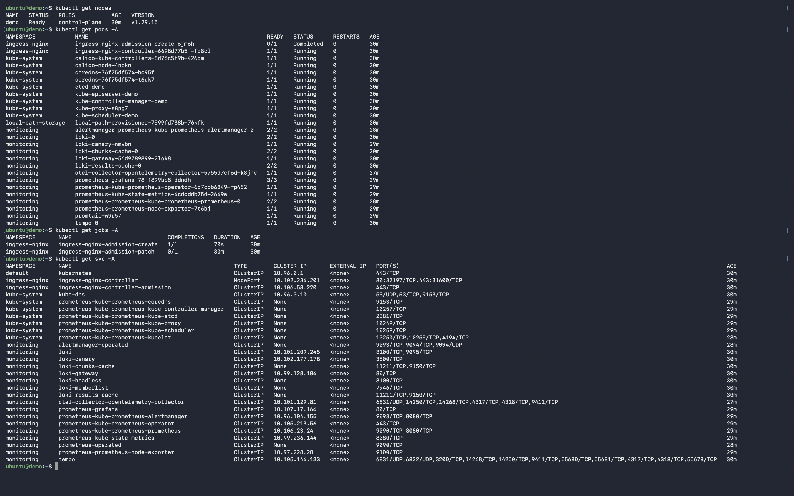
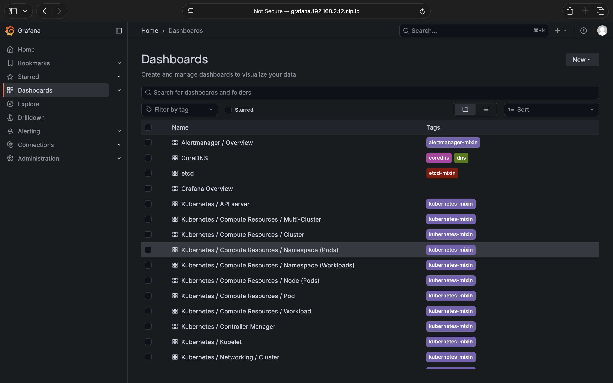
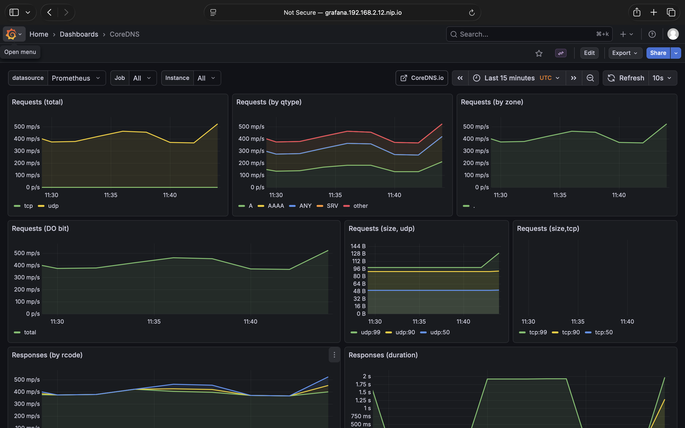
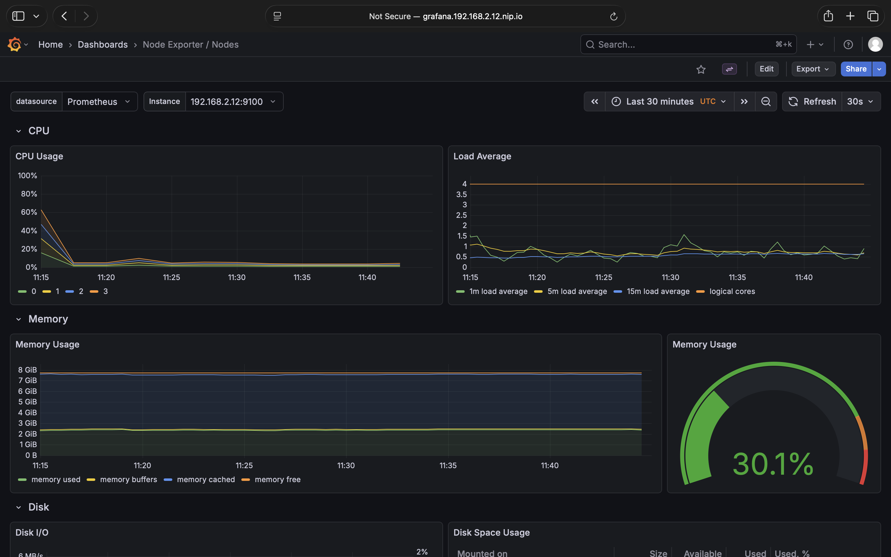
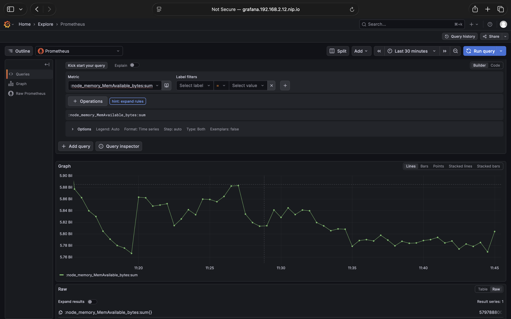
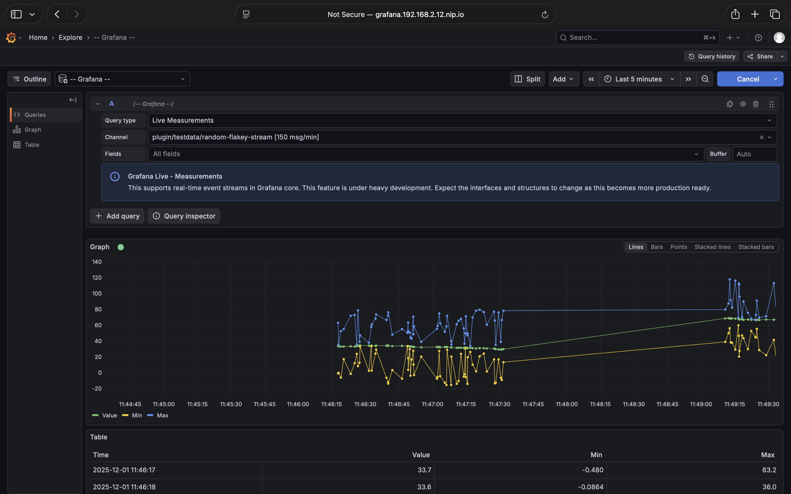
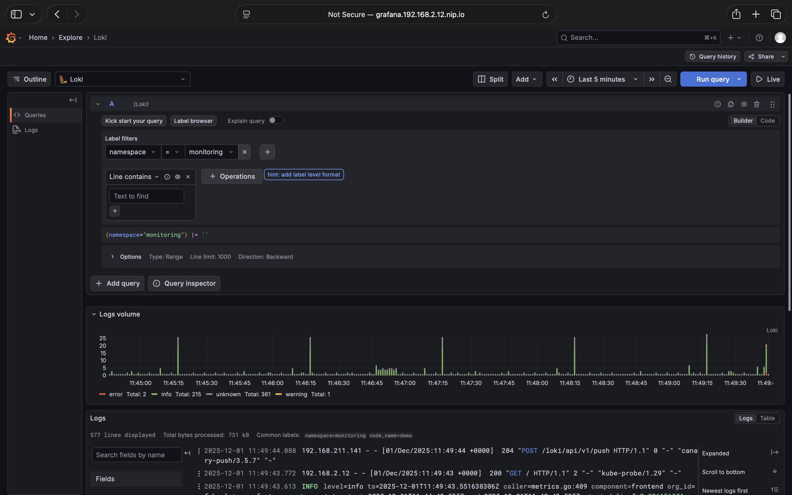
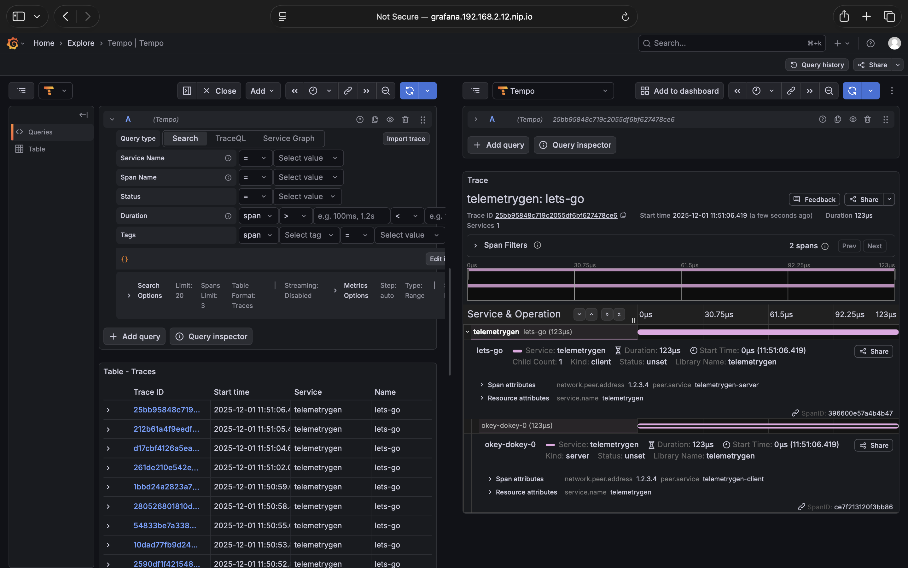

# 🚀 Automated LGTM Observability Stack on Multipass

A "Zero-to-Hero" automation project that deploys a production-grade **Observability Stack** (Loki, Grafana, Tempo, Prometheus) on a local **Multipass VM**.

It provisions a single-node Kubernetes cluster from scratch using `kubeadm`, configures the underlying infrastructure (Storage, Networking, Ingress), and deploys the full monitoring stack with a single command.


---

## 📋 Features

* **Full Automation:** A single master script (`main.sh`) orchestrates the entire process: launching the VM, configuring the OS, installing Kubernetes, and deploying apps.
* **Infrastructure-as-Code:** Modular shell scripts handle specific layers (Runtime, K8s, Helm).
* **Production-Ready Configurations:**
    * **Loki:** Configured in `SingleBinary` mode with filesystem storage (optimized for single-node).
    * **Tempo:** Configured to receive OTLP traces from the OpenTelemetry Collector.
    * **Ingress:** NGINX configured in `HostNetwork` mode, allowing direct access via the VM's IP without external load balancers.
    * **Storage:** Local Path Provisioner enabled for dynamic Persistent Volume Claims (PVCs).
    * **Observability:** Full "LGTM" stack connected and ready to visualize Logs, Metrics, and Traces.

---

## 🛠️ Prerequisites

You only need **Multipass** installed on your host machine.

### MacOS
```bash
brew install multipass
````

### Linux

```bash
sudo snap install multipass
```

### Windows

Download the installer from the [Multipass website](https://multipass.run/install).

-----

## ⚡ Quick Start

1.  **Clone this repository:**

    ```bash
    git clone https://github.com/shivamshashank/multipass-lgtm-stack.git
    cd multipass-lgtm-stack/
    ```

2.  **Run the Master Controller:**

    ```bash
    chmod +x main.sh
    ./main.sh
    ```

    > **☕ Grab a coffee:** The installation takes about **5–10 minutes**. The script will launch the VM, install Kubernetes components, and deploy the entire stack automatically.

3.  **Access Grafana:**
    When finished, the script will print your unique access URL:

      * **URL:** `http://grafana.<YOUR_VM_IP>.nip.io`
      * **User:** `admin`
      * **Password:** `admin`

-----

## 📂 Project Structure

The deployment is split into modular phases for clarity and maintainability.

| Script | Phase | Description |
| :--- | :---: | :--- |
| **`main.sh`** | 🎮 | **Master Controller**. Runs on the host. It transfers all scripts to the VM and executes them in order, handling `sudo` vs `user` permissions automatically. |
| **`01_host_launch.sh`** | 🍏 | Launches a fresh Multipass VM named `demo` (4 CPUs, 8GB RAM, 32GB Disk). Cleans up old VMs if they exist. |
| **`02_vm_prep.sh`** | 🔧 | Prepares the guest OS. Disables swap (K8s requirement), loads kernel modules (`overlay`, `br_netfilter`), and configures sysctl networking. |
| **`03_containerd_setup.sh`** | 📦 | Installs `containerd` and configures `SystemdCgroup = true`, which is critical for Kubeadm stability. |
| **`04_k8s_install.sh`** | ☸️ | Installs core Kubernetes binaries (`kubeadm`, `kubelet`, `kubectl`) from the official apt repositories. |
| **`05_cluster_init.sh`** | 🏗️ | Initializes the cluster (`kubeadm init`), sets up the `ubuntu` user's kubeconfig, and untaints the control plane to allow workloads. |
| **`06_infra_setup.sh`** | 🌐 | Deploys cluster infrastructure: **Calico** (CNI), **Local Path Provisioner** (Storage), and **NGINX Ingress** (patched for HostNetwork). |
| **`07_helm_configs.sh`** | 📝 | Installs **Helm** and generates custom `values.yaml` files for Loki, OpenTelemetry, and the Kube-Prometheus stack (injecting the dynamic VM IP). |
| **`08_deploy_stack.sh`** | 🚀 | The final step. Waits for NGINX to be ready, then uses Helm to deploy the full LGTM stack. |

-----

## 🧪 Verification & Testing

Verify the stack is working by generating synthetic data and viewing it in Grafana.

### 1\. Generate Traces (Test Tempo)

Run this command on your host (it executes inside the VM) to generate fake trace data using the OpenTelemetry `telemetrygen` tool:

```bash
multipass exec demo -- kubectl run trace-gen \
  --image=ghcr.io/open-telemetry/opentelemetry-collector-contrib/telemetrygen:latest \
  --restart=Never \
  -- traces \
  --otlp-insecure \
  --otlp-endpoint=otel-collector-opentelemetry-collector.monitoring.svc.cluster.local:4317 \
  --rate=10 \
  --duration=10m
```

### 2\. View Traces in Grafana

1.  Open Grafana (`http://grafana.<IP>.nip.io`) and go to **Explore** (Compass Icon).
2.  Select **Tempo** from the dropdown.
3.  Click the **Search** tab → **Run Query**.
4.  Click on any **Trace ID** to see the waterfall visualization.

### 3\. Check Logs (Loki)

1.  In **Explore**, select **Loki**.
2.  In "Label filters", select `namespace` = `monitoring`.
3.  Click **Run query** to see live logs from your cluster components.

### 4\. Check Metrics (Prometheus)

1.  Go to **Dashboards**.
2.  Open the **"Node Exporter / Nodes"** dashboard.
3.  You will see live CPU, Memory, and Disk usage stats for your VM.

-----

## 🧹 Cleanup

To stop and remove the VM completely, run:

```bash
multipass delete demo --purge
```

-----

## 📷 Screenshots


-----

-----

-----

-----

-----

-----

-----

-----